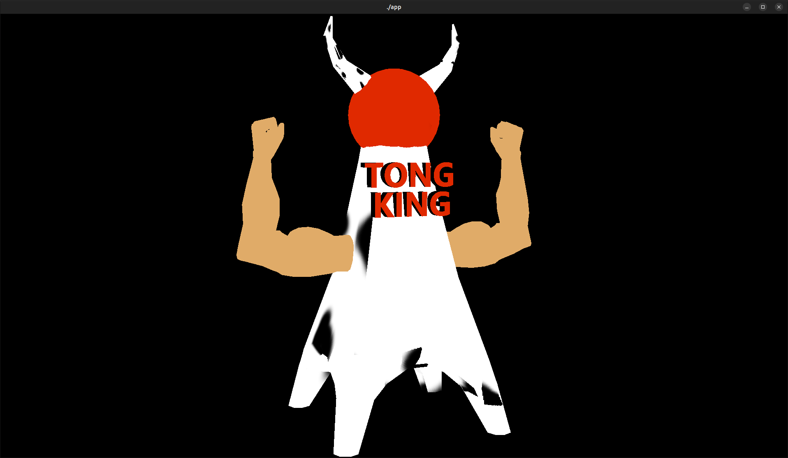

# gl_kadai

東京タワーでございます。

make を実行して出てきた実行ファイル app を起動してみてください。
freeglut3-dev, libpng++-dev がインストールされた linux 環境前提。
実行できなかったときは腹いせに blender で OBJ/TONG_KING_TOWER.blend を開いて和んでください。

昔、高専の課題で書いたコードです。今や疲れているのでデバッグしておりません。
東京タワーのテクスチャ貼りが失敗して変になっております。
ご了承ください。

blender で出力したファイルを解析してオブジェクトごとに分割し、
これを用いて適当に点を配置してオブジェクトを構築してテクスチャを貼るということをやっています。
左クリックで回ります。
